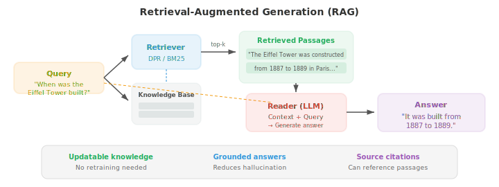
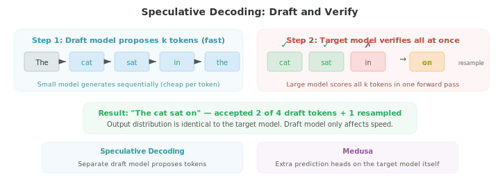

# Advanced Text Generation

- Standard autoregressive generation (file 04) produces text one token at a time, left to right. This is simple and effective, but it is inherently sequential, allows no global planning, and gives limited control over the output. This file covers methods that go beyond vanilla autoregressive decoding: diffusion models for text, optical character recognition, controllable generation through human feedback, handling long contexts, retrieval-augmented generation, and speculative decoding for faster inference.

- **Text diffusion models** apply the diffusion framework (introduced for images in chapter 08) to discrete text. The core challenge is that text is discrete: you cannot add continuous Gaussian noise to tokens the way you add noise to pixels. Several approaches address this.

- **D3PM** (Discrete Denoising Diffusion Probabilistic Models, Austin et al., 2021) defines a forward corruption process directly over discrete tokens using transition matrices. At each forward step, a token has some probability of being replaced by another token (uniform noise), masked (absorbing state), or staying the same. The reverse process learns to denoise, predicting the clean token from the corrupted one. The transition matrix $Q_t$ at step $t$ controls corruption:

$$q(x_t \mid x_{t-1}) = \text{Cat}(x_t ; \, x_{t-1} Q_t)$$

- where $\text{Cat}$ denotes a categorical distribution and $x$ is a one-hot vector. The multi-step forward process $q(x_t \mid x_0)$ has a closed form: $q(x_t \mid x_0) = \text{Cat}(x_t ; \, x_0 \bar{Q}_t)$ where $\bar{Q}_t = Q_1 Q_2 \cdots Q_t$ is the product of all transition matrices up to step $t$. Training minimises a variational lower bound (ELBO) that decomposes across timesteps, similar to the continuous case (chapter 08):

$$\mathcal{L}_{\text{D3PM}} = D_{\text{KL}}(q(x_T \mid x_0) \| p(x_T)) + \sum_{t=2}^{T} D_{\text{KL}}(q(x_{t-1} \mid x_t, x_0) \| p_\theta(x_{t-1} \mid x_t)) - \log p_\theta(x_0 \mid x_1)$$

- The first term ensures the fully corrupted distribution matches the prior (uniform or all-mask). The sum of KL terms trains the model to reverse each corruption step: the true reverse posterior $q(x_{t-1} \mid x_t, x_0)$ can be computed in closed form using Bayes' rule and the known transition matrices, and the model $p_\theta(x_{t-1} \mid x_t)$ is trained to match it. 

- Since both distributions are categorical, the KL divergence is a simple sum over vocabulary entries. The final term measures reconstruction quality from the least corrupted state.

- **MDLM** (Masked Diffusion Language Models, Sahoo et al., 2024) simplifies D3PM by using masking as the only corruption operation: the forward process gradually replaces tokens with a [MASK] token, and the reverse process predicts the original tokens. This connects text diffusion to masked language modelling (BERT, file 04), with the diffusion timestep controlling what fraction of tokens are masked. At $t = 0$ the text is fully clean; at $t = T$ it is fully masked.

- **Continuous text diffusion** sidesteps the discrete problem by working in the continuous embedding space. Tokens are first mapped to their embedding vectors (chapter 06), noise is added in this continuous space, and a denoising model (typically a Transformer) learns to reverse the process. At generation time, the model produces continuous vectors that are mapped back to discrete tokens by finding the nearest embedding. The challenge is that small errors in continuous space can map to completely wrong tokens, so careful rounding and clamping are needed.


- The appeal of text diffusion is that it generates all tokens simultaneously through iterative refinement, rather than left-to-right. This allows global coherence and easy infilling (generating missing text in the middle of a passage), but current text diffusion models still lag behind autoregressive models in generation quality for long-form text.

- **Text OCR** (Optical Character Recognition) is the task of extracting text from images. While not traditionally grouped with language generation, modern OCR systems are deeply integrated with NLP and increasingly use language model components.

- **Scene text detection** locates text regions in natural images (street signs, product labels, licence plates). This is challenging because text in the wild appears at arbitrary angles, scales, fonts, and against cluttered backgrounds. Detection methods typically use CNN or Transformer backbones to produce bounding boxes or segmentation masks around text regions.

- **CRNN** (Convolutional Recurrent Neural Network, Shi et al., 2017) is a classic text recognition architecture. A CNN extracts visual features from the text image, the feature map is sliced into a sequence of columns (one per horizontal position), and a bidirectional LSTM reads this sequence to model context. The output is decoded using **CTC** (Connectionist Temporal Classification), which handles the alignment between input columns and output characters without requiring explicit segmentation.

- The fundamental problem CTC solves: the model produces $T$ output distributions (one per input column), but the target text has $L \leq T$ characters. 

- We do not know which columns correspond to which characters. CTC introduces a **blank token** $\epsilon$ and defines a many-to-one mapping $\mathcal{B}$ that collapses repeated characters and removes blanks: $\mathcal{B}(\text{"HH-ee-ll-ll-oo"}) = \text{"Hello"}$ (where "-" is blank). 

- The probability of the target sequence $y$ is the sum over all input alignments that collapse to $y$:

$$P(y \mid x) = \sum_{\pi \in \mathcal{B}^{-1}(y)} \prod_{t=1}^{T} P(\pi_t \mid x)$$

- where $\pi$ is an alignment path of length $T$ (one label per column, including blanks). Naively summing over all paths is exponential, but the **forward algorithm** (chapter 05 HMMs) computes this sum efficiently in $O(T \cdot L)$ time using dynamic programming. 

- The blank token is essential: without it, repeated characters like "ll" in "Hello" would be indistinguishable from a single "l". Training maximises $\log P(y \mid x)$, and at inference time, the best path is found by beam search or greedy decoding over the CTC output.

- **Document OCR** processes structured documents (invoices, forms, scientific papers) and must understand layout in addition to recognising characters. Modern systems like LayoutLM combine text recognition with spatial position features: each token gets both its text embedding and a positional embedding encoding its $(x, y)$ coordinates on the page. This allows the model to understand that a number appearing below "Total:" is the total amount.


- **Vision-language OCR** models like TrOCR treat text recognition as image-to-text generation: a Vision Transformer encoder processes the image, and a language model decoder generates the text character by character. This leverages the power of pre-trained vision and language models and handles diverse scripts, fonts, and layouts without handcrafted feature engineering.

- **Controllable generation** is the challenge of steering a language model to produce outputs with desired properties: a particular style, topic, sentiment, safety level, or factual accuracy. The model should follow instructions while remaining fluent and coherent.

- **Classifier-free guidance (CFG)** for text adapts a technique from image generation. During training, the conditioning signal (e.g., a prompt) is randomly dropped some fraction of the time, training both a conditional and unconditional model in one. At inference, the output logits are interpolated:

$$\text{logits}_{\text{guided}} = (1 + w) \cdot \text{logits}_{\text{conditional}} - w \cdot \text{logits}_{\text{unconditional}}$$

- where $w > 0$ amplifies the influence of the condition. Higher $w$ makes the output more strongly follow the prompt but reduces diversity.

- **RLHF** (Reinforcement Learning from Human Feedback, Ouyang et al., 2022) is the dominant method for aligning language models with human preferences. The process has three stages:

- First, **supervised fine-tuning (SFT)**: fine-tune the base language model on a dataset of high-quality human-written responses to prompts.

- Second, **reward model training**: collect human comparisons (given prompt $x$ and two responses $y_1, y_2$, which is better?) and train a reward model $r_\phi(x, y)$ to predict human preferences. The reward model is trained with a pairwise ranking loss:

$$\mathcal{L}_{\text{RM}} = -\log \sigma(r_\phi(x, y_w) - r_\phi(x, y_l))$$

- where $y_w$ is the preferred response and $y_l$ is the dispreferred one.

- Third, **RL fine-tuning**: optimise the language model to maximise the reward while staying close to the SFT model (to prevent mode collapse). This uses PPO (Proximal Policy Optimisation, from chapter 06) with a KL penalty:

$$\mathcal{L}_{\text{RL}} = -\mathbb{E}\left[r_\phi(x, y) - \beta \, D_{\text{KL}}(\pi_\theta \| \pi_{\text{SFT}})\right]$$

- The KL term prevents the model from drifting too far from the base model and exploiting quirks of the reward model ("reward hacking").


- **DPO** (Direct Preference Optimisation, Rafailov et al., 2023) simplifies RLHF by eliminating the reward model entirely. The key mathematical insight is that the KL-constrained RL objective above has a closed-form optimal policy:

$$\pi^\ast(y \mid x) = \frac{1}{Z(x)} \pi_{\text{ref}}(y \mid x) \exp\!\left(\frac{r(x, y)}{\beta}\right)$$

- where $Z(x)$ is a normalising partition function. Rearranging this for the reward gives $r(x, y) = \beta \log \frac{\pi^\ast(y \mid x)}{\pi_{\text{ref}}(y \mid x)} + \beta \log Z(x)$. Substituting this implicit reward into the Bradley-Terry preference model $P(y_w \succ y_l) = \sigma(r(x, y_w) - r(x, y_l))$ causes the intractable $Z(x)$ terms to cancel, yielding the DPO loss directly:

$$\mathcal{L}_{\text{DPO}} = -\log \sigma\!\left(\beta \log \frac{\pi_\theta(y_w \mid x)}{\pi_{\text{ref}}(y_w \mid x)} - \beta \log \frac{\pi_\theta(y_l \mid x)}{\pi_{\text{ref}}(y_l \mid x)}\right)$$

- This is mathematically equivalent to RLHF but collapses the reward model and RL training into a single supervised step. 

- The expression inside the sigmoid can be read as: "increase the relative probability of the preferred response and decrease the relative probability of the dispreferred response, measured against the reference model." 

- The $\beta$ parameter controls how much the policy can deviate from the reference. In practice, DPO is simpler to implement (just compute log-probabilities under the current and reference models for both completions) and avoids the instabilities of PPO training.

- **Constitutional AI** (Bai et al., 2022) automates parts of the alignment process. Instead of collecting human comparisons, it uses the language model itself to critique and revise its own outputs according to a set of principles (the "constitution"), such as "choose the response that is less harmful." The AI-generated comparisons are then used for preference training (RLAIF: RL from AI Feedback).

- **Long-context methods** address the $O(n^2)$ memory and compute cost of standard self-attention, which limits sequence length. As $n$ grows into the tens or hundreds of thousands of tokens, standard attention becomes infeasible.

- **Sparse attention** replaces the dense $n \times n$ attention matrix with a sparse pattern where each token attends to only a subset of other tokens. Common patterns include **local attention** (each token attends to a fixed-size window of neighbours), **strided attention** (attend to every $k$-th token), and **random attention** (attend to a random subset). Combinations of these patterns (used in BigBird, Longformer) achieve $O(n)$ or $O(n \sqrt{n})$ complexity while maintaining the ability to capture both local and global dependencies.


- **Sliding window attention** restricts each token to attend only to the previous $w$ tokens (its local window). This is $O(nw)$ rather than $O(n^2)$, but long-range information must propagate through overlapping windows across layers. With $L$ layers and window size $w$, the effective receptive field is $L \times w$ tokens.

- **Ring attention** distributes long sequences across multiple devices by arranging them in a ring topology. Each device holds a chunk of the sequence and computes attention for its chunk while simultaneously sending key-value blocks to the next device in the ring. This overlaps computation with communication and allows sequences of arbitrary length limited only by the total memory across all devices, not the memory of any single one.

- **Memory-augmented models** extend context by equipping the Transformer with an external memory bank. At each layer, the model can read from and write to this memory using attention. Memorizing Transformers cache key-value pairs from previous chunks and attend to them in subsequent chunks, effectively extending context beyond the training window. The retrieval is approximate (using $k$-nearest neighbours over cached keys) to keep it efficient.

- The methods above are **architectural** solutions to long context. Equally important is how models are **trained** to use long contexts effectively.

- **Progressive context extension** is the standard approach. Training on very long sequences from the start is prohibitively expensive ($O(n^2)$ attention cost), so models are pre-trained at a short context length (typically 4K–8K tokens) and then **continued pre-training** extends to the target length in stages. 

- Llama 3.1 extends from 8K to 128K over 800B tokens with gradually increasing sequence length. DeepSeek-V3 trains at 4K, then extends to 32K, then 128K. 

- Each stage uses a modest number of tokens (relative to the full pre-training budget) because the model only needs to learn how to use longer positions, not relearn language itself.

- The position encoding must be adjusted during extension. **RoPE interpolation** scales down the position indices so that the model sees the same rotation angles it was trained on, just spread over a longer sequence. If the model was trained at length $L$ and you want to extend to $L' = 4L$, you divide all position indices by 4. 

- This means the model never sees a rotation angle it has not encountered, but the effective resolution between adjacent positions drops. 

- **RoPE extrapolation** keeps the original position indices unchanged and simply applies RoPE to positions beyond $L$, relying on the model generalising to unseen angles. 

- Interpolation is much more stable; extrapolation degrades rapidly without base frequency adjustment (ABF).

- **YaRN** (Yet another RoPE extensioN) improves on naive interpolation by recognising that not all RoPE dimensions should be treated equally. 

- High-frequency dimensions (small $i$ in $\theta_i = \theta_{\text{base}}^{-2i/d}$) rotate many times within the training length and can extrapolate well. 

- Low-frequency dimensions (large $i$) rotate slowly and are more sensitive to length extension. 

- YaRN interpolates only the low-frequency dimensions, extrapolates the high-frequency ones, and applies a temperature scaling $t$ to the attention logits to compensate for the distributional shift:

$$\text{score}'_{ij} = \frac{q_i^T k_j}{t \sqrt{d_k}}$$

- where $t > 1$ flattens the attention distribution, preventing the model from attending too sharply to nearby tokens when position signals are compressed.

- **Long-context data curation** is a critical and often underestimated challenge. Most pre-training corpora consist of short documents (news articles, web pages, social media posts). 

- Long-context training requires a data mix that actually exercises the full context window: books, code repositories, long-form scientific articles, multi-turn conversation logs, and concatenated thematically related documents. 

- If the model is only trained on short documents padded or packed to fill the context window, it learns to ignore distant tokens because they are never relevant.

- **Sequence packing** is a training efficiency technique: multiple documents are concatenated into a single training sequence to avoid padding waste, with attention masks preventing cross-document attention. 

- For long-context training, the packing strategy matters: packing many unrelated short documents teaches the model that distant tokens are noise, while packing fewer, genuinely long documents teaches it to use the full context.

- A known failure mode is the **"lost in the middle"** phenomenon (Liu et al., 2023): language models tend to use information at the beginning and end of the context window effectively but struggle with information placed in the middle. 

- This resembles the serial position effect in human memory (primacy and recency). 

- It arises partly from training data distributions (important information is often at the start or end of documents) and partly from attention patterns that concentrate on nearby and initial tokens. 

- Long-context training with diverse placement of key information mitigates but does not fully solve this.

- **Needle-in-a-haystack** evaluation tests whether a model can retrieve a specific fact ("the needle") placed at various positions within a long distractor context ("the haystack"). 

- A model with genuine long-context ability should achieve near-perfect retrieval regardless of where the needle is placed. 

- This test reveals the lost-in-the-middle effect clearly and is used to benchmark context extension methods.

- **Long-context fine-tuning** after pre-training uses targeted SFT data: long multi-turn dialogues, document QA with evidence scattered across thousands of tokens, long-form summarisation, and repository-level code understanding. 

- Qwen3 uses **Dual Chunk Attention (DCA)** during this stage, which processes long sequences as pairs of chunks where intra-chunk attention is full and inter-chunk attention is efficient, achieving 4x the effective sequence capacity during fine-tuning.

- **State Space Models (SSMs)** offer a fundamentally different approach to long-sequence modelling. Rather than modifying attention, they replace it entirely with a linear dynamical system inspired by continuous-time control theory. 

- An SSM maps an input sequence $u(t)$ to an output $y(t)$ through a latent state $x(t) \in \mathbb{R}^N$ governed by:

$$x'(t) = Ax(t) + Bu(t), \quad y(t) = Cx(t) + Du(t)$$

- where $A \in \mathbb{R}^{N \times N}$ is the state transition matrix, $B \in \mathbb{R}^{N \times 1}$ is the input projection, $C \in \mathbb{R}^{1 \times N}$ is the output projection, and $D$ is a skip connection. 

- To apply this to discrete sequences (tokens), the continuous system is **discretised** using a step size $\Delta$. The zero-order hold discretisation gives:

$$\bar{A} = \exp(\Delta A), \quad \bar{B} = (\Delta A)^{-1}(\exp(\Delta A) - I) \cdot \Delta B$$

- The discrete recurrence then becomes $x_k = \bar{A} x_{k-1} + \bar{B} u_k$, $y_k = C x_k + D u_k$, which looks like an RNN: process one token at a time with a hidden state. 

- Unlike RNNs, this recurrence can also be unrolled as a **global convolution**: because the system is linear, the output is $y = \bar{K} \ast u$ where the kernel $\bar{K} = (C\bar{B}, \, C\bar{A}\bar{B}, \, C\bar{A}^2\bar{B}, \ldots)$ depends only on the fixed parameters. 

- This **dual view** — recurrence for efficient autoregressive inference ($O(1)$ per step) and convolution for efficient parallel training ($O(n \log n)$ via FFT) — is the central insight of SSMs.


- **S4** (Structured State Spaces for Sequence Modeling, Gu et al., 2022) made SSMs practical by solving the key numerical challenge: the state matrix $A$ must capture long-range dependencies, but naively parameterising it leads to vanishing or exploding dynamics (the same problem as vanilla RNNs). 

- S4 initialises $A$ using the **HiPPO** (High-order Polynomial Projection Operators) matrix, which is derived from the theory of optimal polynomial approximation of continuous signals. The HiPPO matrix has a specific structure that provably enables the state to maintain a compressed representation of the entire input history with graceful decay:

```math
A_{nk} = -\begin{cases} (2n+1)^{1/2}(2k+1)^{1/2} & \text{if } n > k \\ n+1 & \text{if } n = k \\ 0 & \text{if } n < k \end{cases}
```

- This lower-triangular structure ensures that the state acts as an online approximation of the input signal using Legendre polynomials. Computing $\bar{A}^k$ for long kernels is expensive, so S4 uses the fact that the HiPPO matrix can be decomposed as a sum of low-rank and diagonal terms, enabling $O(n \log n)$ kernel computation.

- **Mamba** (Gu and Dao, 2023) introduces the critical innovation of **selective state spaces**: making the SSM parameters input-dependent. In S4, the matrices $A$, $B$, $C$, and the step size $\Delta$ are fixed — the same dynamics apply to every token regardless of content. Mamba makes $B$, $C$, and $\Delta$ functions of the input:

$$B_k = \text{Linear}(u_k), \quad C_k = \text{Linear}(u_k), \quad \Delta_k = \text{softplus}(\text{Linear}(u_k))$$

- This selectivity allows the model to decide, at each position, what information to store in the state and what to ignore — analogous to how attention selects relevant tokens, but without the quadratic cost. The step size $\Delta_k$ controls the "gate": a large $\Delta$ causes the state to integrate the current input strongly (the continuous dynamics advance a large step, effectively resetting the state), while a small $\Delta$ preserves the existing state and ignores the current input.

- The trade-off is that input-dependent parameters break the convolution view (the kernel is no longer fixed), so Mamba cannot use FFT-based training. Instead, it uses a **hardware-aware parallel scan** algorithm that exploits the associativity of the recurrence: the state update $(x_k, u_k) \mapsto x_{k+1}$ can be expressed as a sequence of associative operations and parallelised using a prefix sum (scan), analogous to parallel prefix addition in hardware design. This runs in $O(n)$ time with $O(\log n)$ depth on a GPU, nearly matching the efficiency of convolution.

- Mamba achieves inference that is truly $O(1)$ per token (just update the fixed-size state, no KV cache that grows with context), making it fundamentally more memory-efficient than Transformers at long sequence lengths. The state size $N$ (typically 16) is much smaller than a Transformer's KV cache, which stores $O(n \cdot d)$ values. In practice, Mamba matches or exceeds Transformer quality at the same parameter count on language modelling benchmarks, with significantly faster inference on long sequences.

- **Hybrid architectures** combine SSM layers with attention layers, using SSMs for the majority of layers (efficient long-range propagation) and sprinkling in a few attention layers (precise content-based retrieval). Models like Jamba and Zamba interleave Mamba and Transformer blocks, achieving better quality than pure SSMs while maintaining much of the inference efficiency advantage. This suggests that attention and SSMs capture complementary capabilities: SSMs excel at smooth, long-range state propagation while attention excels at precise, content-dependent lookups.

- **Retrieval-Augmented Generation (RAG)** addresses the knowledge limitations of language models by giving them access to an external knowledge base at inference time. Instead of relying solely on knowledge encoded in model parameters during training, RAG retrieves relevant documents and conditions generation on them.

- The classic **retriever-reader architecture** has two components. The **retriever** takes a query and fetches the top-$k$ most relevant passages from a corpus. The **reader** (a language model) generates the answer conditioned on both the query and the retrieved passages. The retriever can use sparse methods (BM25, which extends TF-IDF from file 02) or dense methods.

- **Dense passage retrieval (DPR)** uses a dual-encoder architecture: one encoder maps questions to vectors, another maps passages to vectors. Both are typically BERT-based. At indexing time, all passages are encoded and stored. At query time, the question is encoded and the nearest passages are found using approximate nearest neighbour search (such as FAISS). The similarity metric is the dot product between question and passage vectors.

- **Chunking strategies** affect retrieval quality significantly. Documents must be split into passages small enough for the retriever to handle, but large enough to contain complete ideas. Fixed-size chunking (e.g., 256 tokens with 50-token overlap) is simple but may split sentences awkwardly. Semantic chunking splits at paragraph or section boundaries. Hierarchical chunking creates a tree of summaries at different granularities.



- RAG provides several advantages: the knowledge base can be updated without retraining the model, the model can cite sources, and hallucination is reduced because the model can ground its answers in retrieved text. The main challenges are retrieval quality (if the wrong passages are retrieved, the model may produce wrong answers confidently) and latency (retrieval adds a step to inference).

- **Speculative decoding** accelerates autoregressive generation by using a small, fast **draft model** to propose multiple tokens in parallel, which are then verified by the large **target model** in a single forward pass.

- The algorithm works as follows: the draft model generates $k$ candidate tokens autoregressively (this is fast because the draft model is small). 

- The target model then scores all $k$ tokens simultaneously in a single forward pass (this is efficient because the work is batched). 

- For each candidate token $t$ sampled from the draft distribution $p_d(t)$, it is accepted with probability $\min(1, \, p_{\text{target}}(t) / p_d(t))$. If rejected, a corrected token is resampled from the **adjusted distribution** $p_{\text{adj}}(t) = \max(0, \, p_{\text{target}}(t) - p_d(t))$, normalised.

- This acceptance-rejection scheme guarantees that the output distribution is identical to the target model alone. 

- To see why, consider the effective probability of emitting token $t$. It can be accepted directly (probability $p_d(t) \cdot \min(1, p_{\text{target}}(t)/p_d(t))$) or produced through resampling. 

- For tokens where $p_{\text{target}}(t) \leq p_d(t)$, the direct acceptance contributes $p_{\text{target}}(t)$. For tokens where $p_{\text{target}}(t) > p_d(t)$, direct acceptance contributes $p_d(t)$ and resampling contributes the remainder $p_{\text{target}}(t) - p_d(t)$ (after accounting for the rejection probability). 

- In both cases, the total probability of emitting $t$ equals $p_{\text{target}}(t)$. The draft model affects only speed, not quality.



- The speedup depends on the acceptance rate: if the draft model is well-aligned with the target model, most tokens are accepted and the wall-clock time is roughly that of the draft model. Typical speedups are 2-3x with no quality degradation.

- **Medusa** (Cai et al., 2024) takes a different approach: instead of a separate draft model, it adds multiple lightweight prediction heads to the target model itself. Each head predicts a different future token position simultaneously ($k = 1, 2, 3, \ldots$ steps ahead). At each step, Medusa proposes several candidate continuations using a tree structure, and a single forward pass through the target model's attention layers verifies which candidates are consistent. This avoids the need for a separate draft model entirely.

- **Parallel generation** methods more broadly aim to break the sequential bottleneck of autoregressive decoding. Jacobi decoding initialises all positions with guesses and iteratively refines them in parallel until convergence, treating generation as a fixed-point iteration. Non-autoregressive models (NAT) generate all tokens simultaneously in a single forward pass but typically suffer quality degradation and require techniques like iterative refinement, CTC loss, or knowledge distillation from autoregressive teachers to close the gap.

- The techniques above — alignment, long context, retrieval, efficient decoding, state space models — come together in modern production LLMs. 

- The remainder of this file surveys the architectural innovations in frontier models, showing how theoretical ideas from files 01–04 and the methods above are combined in practice.

- **Grouped Query Attention (GQA)** is the most widely adopted attention efficiency technique. Standard multi-head attention (MHA) maintains separate key and value projections per head, requiring $n_{\text{heads}} \times d_{\text{head}}$ values cached per token. GQA groups multiple query heads to share a single key-value head. 

- With 64 query heads and 8 KV heads (a common configuration in Llama 3, Qwen, Gemma), each KV head is shared by 8 query heads, reducing the KV cache by 8x compared to MHA. 

- The output quality is nearly identical to MHA because the queries can still attend to different patterns, they just share the same key-value subspace. Multi-query attention (MQA) is the extreme case with a single KV head for all queries, but GQA provides a better quality-efficiency trade-off.

- **Multi-head Latent Attention (MLA)**, introduced in DeepSeek-V2, achieves even more aggressive KV cache compression. Instead of caching the full key-value projections (even with GQA), MLA down-projects the hidden state into a low-rank **latent vector** $c_t \in \mathbb{R}^{d_c}$ with $d_c \ll n_{\text{heads}} \times d_{\text{head}}$:

$$c_t = W_{\text{down}} \, h_t$$

- Only this compressed vector is cached. At attention time, the full key and value representations are reconstructed via up-projection: $k_t = W_{\text{up}}^K c_t$, $v_t = W_{\text{up}}^V c_t$. In DeepSeek-V3 (671B total parameters, 37B active), the compression dimension is $d_c = 512$ versus $128 \times 128 = 16{,}384$ for full MHA, a 93% reduction in KV cache. 

- A subtlety: standard RoPE is position-dependent and incompatible with the shared compression, so MLA uses **decoupled RoPE**: a small separate stream of the query and key (64 dimensions per head) carries position information via RoPE, while the bulk of the representation flows through the compressed latent path.


- **Position encoding at scale** has diverged significantly from the original sinusoidal scheme. All frontier models use **RoPE** (file 04), but with key modifications for long context. The base frequency $\theta_{\text{base}}$ in the original RoPE formula $\theta_i = \theta_{\text{base}}^{-2i/d}$ is typically 10,000, which limits extrapolation beyond the training length. 

- **Adjusted Base Frequency (ABF)** simply increases $\theta_{\text{base}}$ to 500,000 (Llama 3) or 1,000,000 (Qwen3, Gemma 3), stretching the rotation periods so the model encounters fewer full rotations during training and can extrapolate further. 

- **YaRN** (Yet another RoPE extensioN) applies frequency-dependent interpolation: low-frequency dimensions are interpolated (scaled down), high-frequency dimensions are extrapolated, and a temperature factor adjusts the attention distribution. DeepSeek-V3, Qwen, and Kimi K2 all use YaRN-based extension to reach 128K context from models pre-trained at 4K–8K.

- **iRoPE** (interleaved RoPE), introduced in Llama 4, takes a more radical approach: every 4th attention layer uses **no positional encoding at all** (NoPE), while the other layers use standard RoPE with chunked attention. 

- The NoPE layers can attend to all positions without any positional bias, while the RoPE layers provide local ordering. Combined with temperature scaling at inference, this enables Llama 4 Scout's 10M-token context window — orders of magnitude beyond any pure RoPE approach.

- **Mixture of Experts at scale** has become the dominant architecture for frontier models (file 04 introduced MoE fundamentals). The key design choices are the number of experts, routing sparsity, and load balancing.

- **Routing sparsity** varies significantly: DeepSeek-V3 uses 256 experts with top-8 routing (32x sparsity), Qwen3 uses 128 experts with top-8 (16x sparsity), Mixtral uses 8 experts with top-2 (4x sparsity), and Llama 4 Maverick uses 128 experts with top-1 plus a shared expert (128x sparsity). 

- Higher sparsity means more total parameters for the same active compute, but requires more careful load balancing and communication infrastructure.

- **Auxiliary-loss-free load balancing** (DeepSeek-V3) replaces the traditional load balancing loss (file 04) which was found to degrade model quality. Instead, each expert maintains a dynamic bias term adjusted per training step: overloaded experts have their bias decreased (receiving fewer tokens), underloaded experts have their bias increased. This achieves balanced routing without any auxiliary loss polluting the main training signal.

- **Shared experts** appear in most MoE designs: one or more expert FFNs that process every token regardless of routing. These handle common patterns that all tokens need (basic syntax, function words), freeing the routed experts to specialise. Llama 4 uses 1 shared expert plus 1 routed expert per token (very sparse); DeepSeek-V3 uses 1 shared plus 8 routed.

- **Alternating dense and MoE layers** provide another design axis. Gemma 2 and 3 alternate local/global attention layers (5:1 ratio in Gemma 3, where local layers use a 1,024-token sliding window and only global layers cache the full 128K context). 

- Llama 4 Maverick interleaves dense FFN layers with MoE layers. Kimi K2 uses hybrid-sparsity layers (one dense layer interspersed among expert layers). This heterogeneous design allows different layers to serve different functions.

- **Multi-token prediction (MTP)**, used in DeepSeek-V3, trains the model to predict not just the next token but also the token after that. At each position, a secondary prediction module (sharing the main model's embeddings) predicts one additional future token. The MTP loss is weighted at 0.1–0.3 relative to the main next-token loss. Beyond improving representation quality during training, the MTP heads can serve as draft heads for speculative decoding at inference time, providing a free speedup.

- **Knowledge distillation** is a training strategy where a large "teacher" model's outputs guide the training of a smaller "student" model. Gemma 2 and 3 use distillation extensively: the smaller models (2B, 4B) are trained on 50x the compute-optimal amount of data with the teacher's probability distributions as soft targets. This is why Gemma 3-4B matches Gemma 2-27B in quality. 

- The distillation loss replaces or supplements the standard cross-entropy: the student minimises the KL divergence between its output distribution and the teacher's:

$$\mathcal{L}_{\text{distill}} = D_{\text{KL}}(p_{\text{teacher}}(\cdot \mid x) \| p_{\text{student}}(\cdot \mid x))$$

- DeepSeek-R1 distilled its 671B reasoning model into dense models as small as 1.5B using 800K curated chain-of-thought samples, producing small models with disproportionately strong reasoning.

- **Reasoning via reinforcement learning** represents the most significant recent advance in LLM capabilities. DeepSeek-R1 demonstrated that pure reinforcement learning on a base model (without supervised fine-tuning) can elicit chain-of-thought reasoning, self-verification, and error correction, behaviours that emerge spontaneously when the model is rewarded for correct final answers.

- DeepSeek-R1 uses **GRPO** (Group Relative Policy Optimisation), which eliminates the value network required by PPO. For each prompt, GRPO samples a group of $G$ outputs, computes their rewards, and normalises advantages within the group:

$$A_i = \frac{r_i - \text{mean}(r_1, \ldots, r_G)}{\text{std}(r_1, \ldots, r_G)}$$

- The policy gradient then uses these group-relative advantages with a clipped objective (similar to PPO's clipping). 

- Eliminating the critic network halves the memory and compute requirements of RL training, making it practical to train 671B-parameter models with RL. 

- A critical design choice: DeepSeek-R1 uses **rule-based rewards** (checking mathematical answers against ground truth, running code test cases) rather than neural reward models, because neural reward models were found to be susceptible to reward hacking at this scale.

- **Qwen3's hybrid thinking mode** integrates reasoning (with `<think>` tags for step-by-step chain-of-thought) and fast direct response into a single model, allowing users to control a "thinking budget" that trades latency for reasoning depth. 

- This is achieved by training on both thinking and non-thinking data, not through separate model checkpoints.

- **Training stabilisation at scale** requires new techniques beyond standard practices. **Logit soft-capping** (Gemma 2) passes attention scores through $s \cdot \tanh(\text{logits} / s)$ with a soft cap $s$ (typically 30–50) to prevent unbounded growth. 

- **QK-Norm** (Qwen3) applies RMSNorm to query and key vectors before computing attention scores, replacing the need for QKV bias. **QK-Clip** (Kimi K2's MuonClip optimiser) monitors the maximum attention logit during training and rescales query-key weight matrices when they exceed a threshold, enabling stable pre-training of 1T-parameter models with zero instability events.

- **FP8 mixed-precision training** (DeepSeek-V3) uses 8-bit floating point for the compute-intensive matrix multiplications in the forward and backward passes while keeping master weights in higher precision. 

- This roughly doubles throughput compared to BF16/FP16 training with negligible quality loss. DeepSeek-V3 trained its 671B-parameter model for only 2.8M H800 GPU-hours — a fraction of comparable models — largely due to this and other engineering optimisations.

## Coding Tasks (use CoLab or notebook)

1. Implement a simple retrieval-augmented generation pipeline from scratch. Index a set of documents using TF-IDF (file 02), retrieve the most relevant passage for a query, and prepend it to a prompt.
```python
import jax.numpy as jnp
import math
from collections import Counter

# Knowledge base: a set of short passages
knowledge_base = [
    "The Eiffel Tower is a wrought-iron lattice tower in Paris, France. It was constructed from 1887 to 1889 as the centerpiece of the 1889 World's Fair.",
    "The Great Wall of China is a series of fortifications built along the northern borders of China. Construction began in the 7th century BC.",
    "Photosynthesis is the process by which plants convert sunlight, water, and carbon dioxide into glucose and oxygen using chlorophyll.",
    "The theory of general relativity, published by Albert Einstein in 1915, describes gravity as the curvature of spacetime caused by mass and energy.",
    "Python is a high-level programming language known for its simple syntax and readability. It was created by Guido van Rossum and released in 1991.",
    "The mitochondria are organelles found in eukaryotic cells. They generate most of the cell's supply of ATP, used as a source of chemical energy.",
]

# Build TF-IDF index (reusing concepts from file 02)
def tokenise(text):
    return text.lower().split()

vocab = sorted(set(w for doc in knowledge_base for w in tokenise(doc)))
word2idx = {w: i for i, w in enumerate(vocab)}
V = len(vocab)
N = len(knowledge_base)

# Document frequencies
doc_freq = Counter()
for doc in knowledge_base:
    for w in set(tokenise(doc)):
        doc_freq[w] += 1

def tfidf_vector(text):
    words = tokenise(text)
    counts = Counter(words)
    vec = jnp.zeros(V)
    for w, c in counts.items():
        if w in word2idx:
            tf = 1 + math.log(c)
            idf = math.log(N / (doc_freq.get(w, 0) + 1))
            vec = vec.at[word2idx[w]].set(tf * idf)
    return vec

# Index all documents
doc_vectors = jnp.stack([tfidf_vector(doc) for doc in knowledge_base])

def cosine_sim(a, b):
    return jnp.dot(a, b) / (jnp.linalg.norm(a) * jnp.linalg.norm(b) + 1e-8)

def retrieve(query, top_k=2):
    """Retrieve top-k most relevant passages for a query."""
    q_vec = tfidf_vector(query)
    sims = jnp.array([cosine_sim(q_vec, doc_vectors[i]) for i in range(N)])
    top_indices = jnp.argsort(-sims)[:top_k]
    return [(int(i), float(sims[i]), knowledge_base[int(i)]) for i in top_indices]

# Test retrieval
queries = [
    "Who built the Eiffel Tower?",
    "How do plants make food?",
    "What did Einstein discover?",
]

for query in queries:
    results = retrieve(query, top_k=1)
    print(f"\nQuery: '{query}'")
    for idx, sim, passage in results:
        print(f"  Retrieved (sim={sim:.3f}): '{passage[:80]}...'")

    # RAG-style prompt construction
    context = results[0][2]
    rag_prompt = f"Context: {context}\n\nQuestion: {query}\nAnswer:"
    print(f"  RAG prompt:\n    {rag_prompt[:120]}...")
```

2. Implement speculative decoding with a toy draft and target model. Show that the accepted output matches the target model's distribution.
```python
import jax
import jax.numpy as jnp

# Simulate a draft model (fast, less accurate) and target model (slow, accurate)
vocab_size = 8
seq_len = 5

key = jax.random.PRNGKey(42)

# Target model: returns logits given a sequence
def target_model(seq, key):
    """Simulated target model: produces token logits (expensive)."""
    # In practice this would be a large Transformer forward pass
    k1, k2 = jax.random.split(key)
    logits = jax.random.normal(k1, (len(seq), vocab_size)) * 2
    # Make it somewhat predictable: bias toward token (seq[-1] + 1) % vocab_size
    for i in range(len(seq)):
        logits = logits.at[i, (seq[i] + 1) % vocab_size].add(3.0)
    return logits

def draft_model(seq, key):
    """Simulated draft model: similar but noisier (cheap)."""
    k1, k2 = jax.random.split(key)
    logits = jax.random.normal(k1, (len(seq), vocab_size))
    for i in range(len(seq)):
        logits = logits.at[i, (seq[i] + 1) % vocab_size].add(2.0)
    return logits

def sample_token(logits, key):
    return jax.random.categorical(key, logits)

def speculative_decode(prefix, draft_steps=3, key=jax.random.PRNGKey(0)):
    """Speculative decoding: draft proposes, target verifies."""
    seq = list(prefix)
    total_accepted = 0
    total_proposed = 0

    for _ in range(4):  # generate 4 rounds
        key, *subkeys = jax.random.split(key, draft_steps + 3)

        # Draft model proposes draft_steps tokens
        draft_tokens = []
        draft_probs = []
        draft_seq = list(seq)
        for i in range(draft_steps):
            d_logits = draft_model(jnp.array(draft_seq), subkeys[i])
            d_probs = jax.nn.softmax(d_logits[-1])
            tok = sample_token(d_logits[-1], subkeys[i])
            draft_tokens.append(int(tok))
            draft_probs.append(d_probs)
            draft_seq.append(int(tok))

        # Target model scores all draft tokens in one pass
        target_logits = target_model(jnp.array(draft_seq), subkeys[draft_steps])
        target_start = len(seq) - 1  # position of last prefix token

        # Accept/reject each draft token
        accepted = 0
        for i in range(draft_steps):
            t_probs = jax.nn.softmax(target_logits[target_start + i])
            d_prob = draft_probs[i][draft_tokens[i]]
            t_prob = t_probs[draft_tokens[i]]

            # Accept with probability min(1, target_prob / draft_prob)
            accept_prob = jnp.minimum(1.0, t_prob / (d_prob + 1e-10))
            key, accept_key = jax.random.split(key)
            if jax.random.uniform(accept_key) < accept_prob:
                seq.append(draft_tokens[i])
                accepted += 1
            else:
                # Reject: sample from adjusted distribution
                key, resample_key = jax.random.split(key)
                adjusted = jnp.maximum(0, t_probs - draft_probs[i])
                adjusted = adjusted / (adjusted.sum() + 1e-10)
                new_tok = jax.random.categorical(resample_key, jnp.log(adjusted + 1e-10))
                seq.append(int(new_tok))
                break

        total_accepted += accepted
        total_proposed += draft_steps

    return seq, total_accepted, total_proposed

# Run speculative decoding
prefix = [0, 1]
result_seq, accepted, proposed = speculative_decode(prefix)
acceptance_rate = accepted / proposed if proposed > 0 else 0

print(f"Prefix: {prefix}")
print(f"Generated sequence: {result_seq}")
print(f"Draft proposals: {proposed}")
print(f"Accepted: {accepted}")
print(f"Acceptance rate: {acceptance_rate:.1%}")
print(f"Speedup potential: {(accepted + proposed) / proposed:.2f}x")
```

3. Build a simple DPO training loop. Given pairs of preferred and dispreferred completions, update a small model using the DPO loss.
```python
import jax
import jax.numpy as jnp

# Tiny language model: linear projection from one-hot to logits
vocab_size = 10
seq_len = 4

key = jax.random.PRNGKey(42)
k1, k2 = jax.random.split(key)

# Current policy parameters (trainable)
theta = jax.random.normal(k1, (vocab_size, vocab_size)) * 0.1
# Reference policy parameters (frozen copy of initial theta)
theta_ref = theta.copy()

def log_prob_sequence(params, sequence):
    """Compute log P(sequence) under a simple autoregressive model."""
    total = 0.0
    for t in range(1, len(sequence)):
        # Simple: logits at position t depend on token at t-1
        logits = params[sequence[t-1]]
        log_probs = jax.nn.log_softmax(logits)
        total += log_probs[sequence[t]]
    return total

def dpo_loss(theta, theta_ref, preferred, dispreferred, beta=0.1):
    """Direct Preference Optimisation loss for one pair."""
    log_pi_w = log_prob_sequence(theta, preferred)
    log_pi_l = log_prob_sequence(theta, dispreferred)
    log_ref_w = log_prob_sequence(theta_ref, preferred)
    log_ref_l = log_prob_sequence(theta_ref, dispreferred)

    # DPO objective
    return -jax.nn.log_sigmoid(
        beta * ((log_pi_w - log_ref_w) - (log_pi_l - log_ref_l))
    )

# Preference dataset: (prompt_prefix, preferred_completion, dispreferred_completion)
preferences = [
    (jnp.array([1, 3, 5, 7]), jnp.array([1, 3, 5, 2])),  # prefer 7 over 2 at end
    (jnp.array([0, 2, 4, 6]), jnp.array([0, 2, 4, 9])),  # prefer 6 over 9
    (jnp.array([3, 3, 3, 3]), jnp.array([3, 3, 3, 0])),  # prefer repeating over 0
    (jnp.array([5, 6, 7, 8]), jnp.array([5, 6, 7, 1])),  # prefer 8 over 1
]

grad_fn = jax.jit(jax.grad(dpo_loss))
lr = 0.05

print("Training DPO...")
for epoch in range(100):
    total_loss = 0.0
    for preferred, dispreferred in preferences:
        loss = dpo_loss(theta, theta_ref, preferred, dispreferred)
        grads = grad_fn(theta, theta_ref, preferred, dispreferred)
        theta = theta - lr * grads
        total_loss += loss
    if (epoch + 1) % 20 == 0:
        avg_loss = total_loss / len(preferences)
        print(f"  Epoch {epoch+1}: avg DPO loss = {avg_loss:.4f}")

# Check: the model should now prefer the preferred completions
print("\nPreference check after DPO training:")
for preferred, dispreferred in preferences:
    lp_w = log_prob_sequence(theta, preferred)
    lp_l = log_prob_sequence(theta, dispreferred)
    print(f"  Preferred {list(preferred.astype(int))}: logP={lp_w:.3f}  "
          f"Dispreferred {list(dispreferred.astype(int))}: logP={lp_l:.3f}  "
          f"{'correct' if lp_w > lp_l else 'WRONG'}")
```
